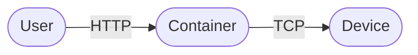

# Switcher WebAPI Docs



```shell
docker run -d -p 8000:8000 --name switcher_webapi tomerfi/switcher_webapi:latest
```
???- tip "Debugging issues? Set the log level."
    ```shell
    docker run -d -p 8000:8000 -e LOG_LEVEL=DEBUG --name switcher_webapi tomerfi/switcher_webapi:latest
    ```
    Accepted values: DEBUG / **INFO** / WARNING / ERROR / CRITICAL

???- note "New Switcher devices require a token." 
    Get the token at https://switcher.co.il/GetKey.

???- warning "Since version 2.x.x, all endpoints require a device type query param."
    --8<-- "device_types.md"

--8<-- "endpoints_all.md"
